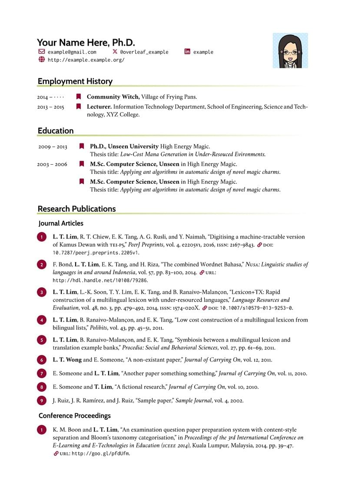

# LaTeX CV Template

A clean, modern, and customizable CV template based on the `curve` LaTeX class.

## Preview



[View the generated PDF of another generic example (main branch)](cv-main.pdf)

## Features

- **Modular Design**: Sections are separated into `.tex` files. Includes new sections like `projects.tex` and `earlier-career.tex`.
- **Publication Support**: Integrated `biblatex` support.
- **Social Icons**: Built-in support for `fontawesome5` and `simpleicons`.
- **Photo Inclusion**: Optional profile photo support.

## Prerequisites

You will need a LaTeX distribution.

- **Windows Users**: We recommend using [MiKTeX](https://miktex.org/) along with the **TeXworks** editor for easy setup and compilation.
- Other platforms can use TeX Live or MacTeX.

Packages heavily used: `curve`, `biblatex`, `fontawesome5`, `simpleicons`, `geometry`, `xcolor`, and `tikz`.

## Usage

### 1. Customization

- **Main File**: Edit `cv-main.tex` to update personal info and toggle sections.
- **Sections**: Update the individual `.tex` files:
    - `profile.tex`
    - `education.tex`
    - `employment.tex` / `earlier-career.tex`
    - `projects.tex`
    - `skills.tex`
    - `publications.tex` / `misc.tex`
    - `referee-full.tex`
- **Styling**: Modify `settings.sty`.
- **Publications**: Add your papers to `own-bib.bib`.

### 2. Compilation

XeLaTeX or LuaLaTeX is recommended if using OpenType fonts.

```bash
# Using latexmk (recommended)
latexmk -pdf -xelatex cv-main.tex

# Or manually with XeLaTeX
xelatex cv-main.tex
biber cv-main
xelatex cv-main.tex
```

## Acknowledgments

- Inspired by the work of [LianTze Lim](mailto:liantze@gmail.com)
